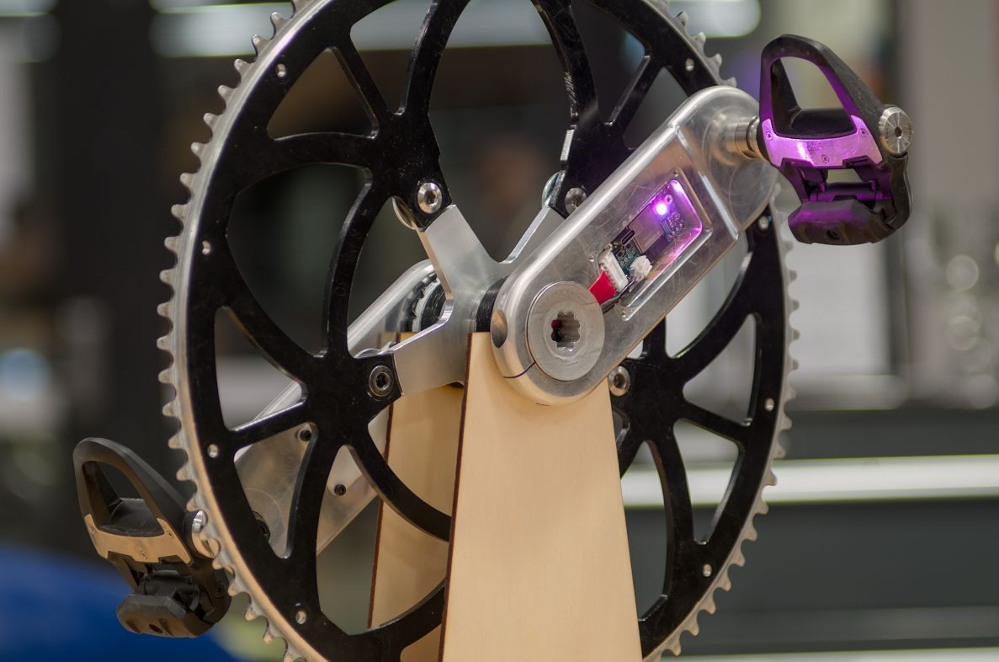

# Cycling power meter final year project <!-- omit in toc -->
Oscar Varney and Jotham Gates, 2024

This is the code repository for a Final Year Project (FYP) to develop a crankset and power meter for Human Powered Vehicles (HPVs).

<p align="center">
    
</p>

## Contents <!-- omit in toc -->
- [Getting started](#getting-started)
- [Schematic and PCB layout](#schematic-and-pcb-layout)
- [Code](#code)
  - [Libraries](#libraries)
  - [Tools for updating dates of changed files and versions](#tools-for-updating-dates-of-changed-files-and-versions)
    - [Git Hook for checking dates are correct before committing](#git-hook-for-checking-dates-are-correct-before-committing)
  - [Doxygen documentation](#doxygen-documentation)
- [Scripts and testing](#scripts-and-testing)


## Getting started
- See [here](./documents/getting_started_mqtt.md) for some instructions on getting the power meter to work with MQTT and WiFi.
- See [here](./configs/README.md) for information on configuring the power meter.
- See [here](./documents/mqtt_topics.md) for information on MQTT topics used when communicating using this protocol.
- If you are a member of MHP, then the Notion page for this project can be found [here](https://www.notion.so/monashhumanpower/Power-Pedals-Cranks-FYP-3e6eb409a05642b1ad961b32c2f40aa7).

## Schematic and PCB layout
The schematic and PCB layout were completed using [KiCAD 8](https://www.kicad.org/). The design files are in the [`power-meter-pcb`](./power-meter-pcb/) folder.

## Code
The firmware is written to use the Arduino environment of Platform IO and is located in the [`power-meter-code`](power-meter-code) directory.

### Libraries
Install the following libraries, either by using the Arduino library manager or going to their GitHub repository and cloning them.
- [ArduinoJson](https://arduinojson.org/) library for JSON encoding and decoding.
- [ICM42670P](https://github.com/tdk-invn-oss/motion.arduino.ICM42670P) library for communicating with the IMU.
- [BasicLinearAlgebra](https://github.com/tomstewart89/BasicLinearAlgebra/) library for matrix maths. This is also added as a submodule for testing the Kalman filter on a computer.
- [ArduinoBLE](https://github.com/arduino-libraries/ArduinoBLE) library for Bluetooth Low Energy (BLE) communications.
- [PubSubClient](https://pubsubclient.knolleary.net/) library for communicating using MQTT over WiFi.

### Tools for updating dates of changed files and versions
A bash script has been written to update the dates on all modified or staged files (not including untracked files). To perform this operation, run:
```bash
./tools/update_date.sh
```

Another script is included to update the version info on all files and definitions for the code. The files and elements updated include:
- Any `@version` tags in the code directory.
- The `VERSION` definition in [`defines.h`](./power-meter-code/defines.h).
- The Doxygen version number in [`Doxyfile`](./Doxyfile).

As an example:
```bash
./tools/update_version.sh 1.2.3
```

#### Git Hook for checking dates are correct before committing
> This needs to be modified to work with the platform IO structure.
Copy the [`pre-commit`](./tools/pre-commit) file into [`.git/hooks/pre-commit`](.git/hooks/pre-commit). This will check the date of code files and make sure they are up to date.

### Doxygen documentation
Documentation can be automatically generated using Doxygen by running `doxygen` from the root folder of the repository. You might need to install doxygen and graphviz first. The output will be placed in the [`docs`](docs) folder. GitHub actions may be set up later down the track to automatically generate and deploy to GitHub pages on commit- however that would require a public repository and documentation.

To generate a massive appendix for the report, run `./tools/generate_refman.sh`

The output file will be [`refman.pdf`](docs/latex/refman.pdf).

## Scripts and testing
Scripts for testing the board hardware and easing development of certain sections can be found in the [`scripts-testing`](./scripts-testing/) directory. This includes python scripts used to log data over MQTT and plot it.